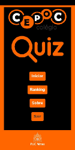
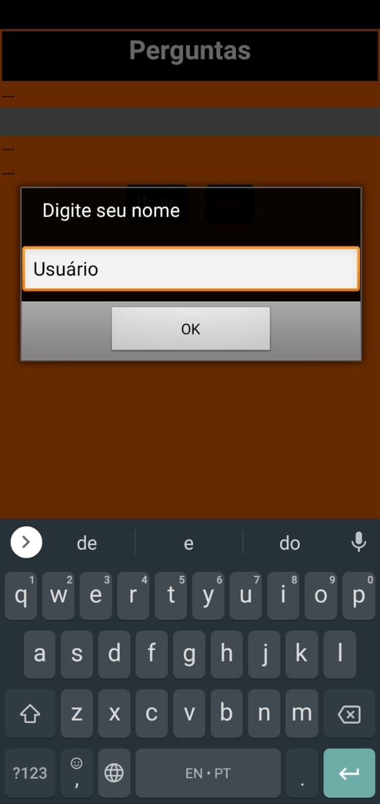
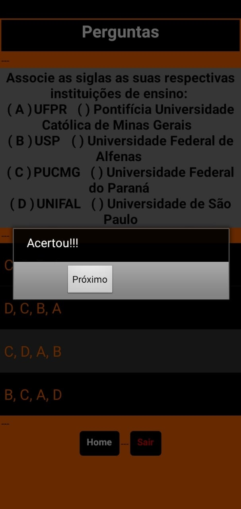
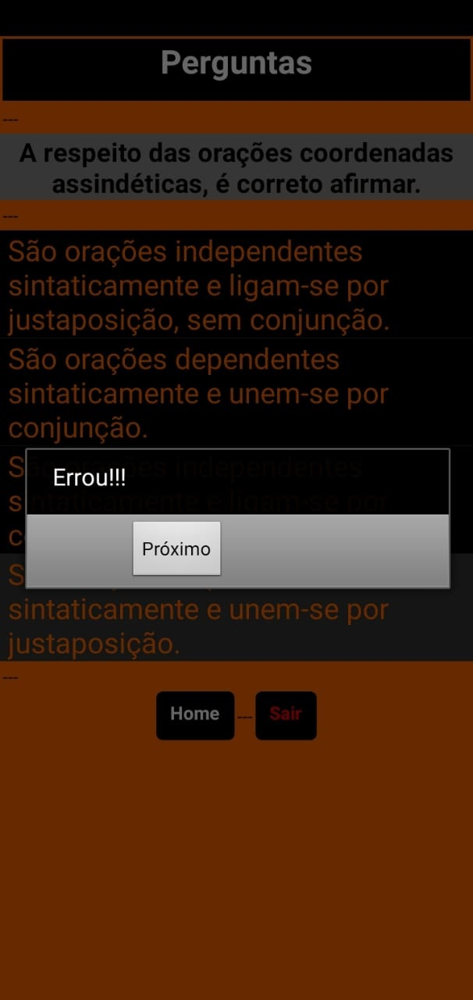
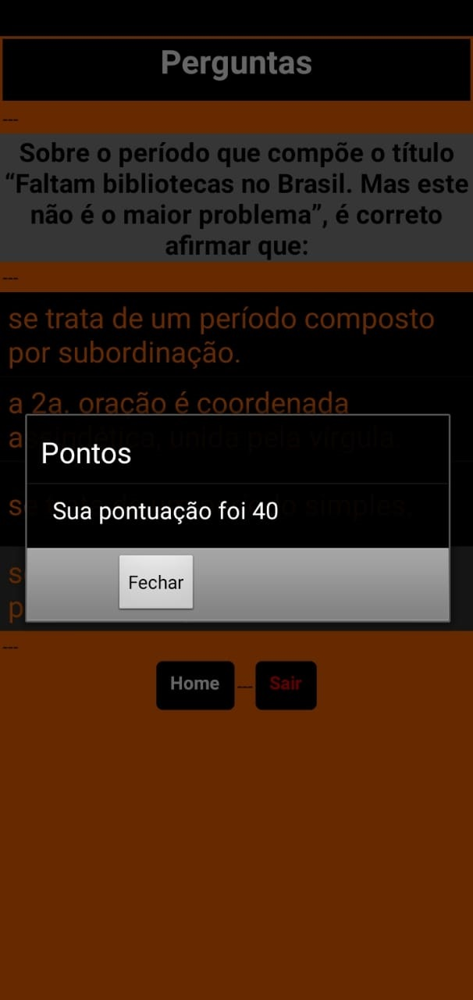
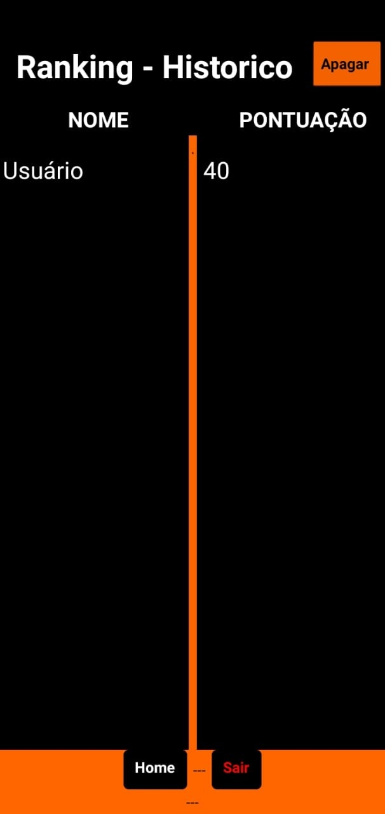
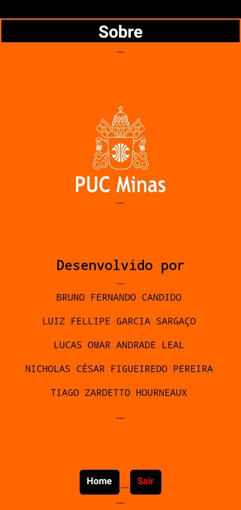

# Mentoring II - Projeto CEPOC Linguagens
The project was developed during second semester of 2020 in partnership with [PUCMINAS University](https://www.pucpcaldas.br/) and 
[CEPOC School](http://cepoc.com.br/), in order to create some tools that can help teachers in their teaching methodology, during Covid-19 pandemic. 

Our team's project was responsible to support portuguese teacher teaching grammatics and abbreviations to students of about 12 to 13 years old.

The application was built using [MIT Appinventor](https://appinventor.mit.edu/).

## About the application

The application is a 10 questions quiz that you have to answer, there is no time limit and is very simple to use. 
You just have to press "Iniciar" to start and then enter your username. 

Afterwards, you have to answer 10 questions about portuguese grammatics and abbreviations. 
Once you answer a question, a little window will pop up showing you if you answered it correctly or not. At the end of the 10th question, 
after it exhibit you if you got it right or wrong, another window will pop up, this time revealing to you your overall score. 

Your score will be saved at "Ranking" tab, but don't worry you can remove your scores by tapping "Apagar".
The "Sobre" tab contain the names of the developers of the application.
By pressing "Sair" you exit the game. 

## Download

The application is available for download at [Projeto CEPOC Linguagens](https://mega.nz/file/Iognkaya#xB5JyBMbw21uf02GKDjZ2NmbKWgODO3dtfmDA_mX-yw) 

## Screenshots

  
  
  
  
  
  
  
  
  

  
## Advisers 

* João Carlos de Moraes Morselli Junior
* [Fabiano Costa Teixeira](https://github.com/fabianocostateixeira)

## Developers 

* Bruno Fernando Candido
* [Luiz Fellipe Garcia Sargaço](https://github.com/LuizFGarcia)
* [Lucas Omar Andrade Leal](https://github.com/lucasoal)
* [Nicholas César Figueiredo Pereira](https://github.com/nicholascfp)
* Tiago Zardetto Hourneaux
